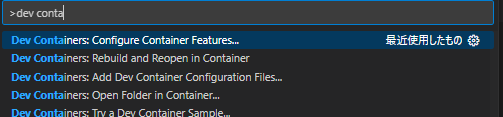
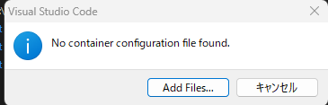
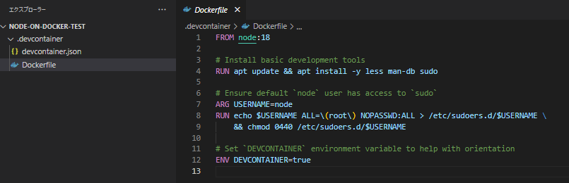
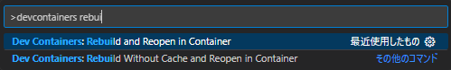
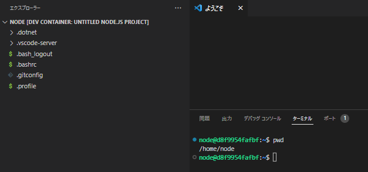
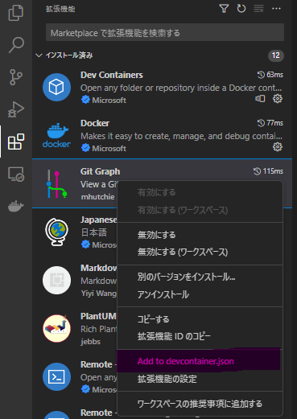
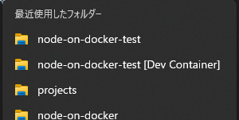

# はじめに
ここにリポジトリの説明を入力

# 必要ソフトウェア
* Docker
* VSCode
    - [Dev Containers](https://marketplace.visualstudio.com/items?itemName=ms-vscode-remote.remote-containers)

# 環境構築手順

* 開発用ディレクトリを作成
```Shell
mkdir node-on-docker-test
```

* VSCodeでディレクトリを開き､下記コマンドを実行
```
Ctrl + Shift + P
> Dev Containers: Configure Container Features...
```


* `Add Files...`を選択


* 必要な構成を指定して`OK`



* `workspaceMount`, `workspaceFolder`を追加する
```diff
>>> .devcontainer/devcontainer.json
{
	"name": "Untitled Node.js project",
	"build": {
		"dockerfile": "Dockerfile"
	},
+	"workspaceMount": "source=DOCKER_IMAGE_NAME,target=/home/node,type=volume,consistency=cached",
+	"workspaceFolder": "/home/node",
	"remoteUser": "node"
}
```

* DOCKER_IMAGE_NAMEをプロジェクト名称等で更新
DOCKER_IMAGE_NAME: Dockerで生成されるボリュームの名称

```diff
>>> .devcontainer/devcontainer.json
{
	"name": "Untitled Node.js project",
	"build": {
		"dockerfile": "Dockerfile"
	},
+	"workspaceMount": "source=node-on-docker-test,target=/home/node,type=volume,consistency=cached",
+	"workspaceFolder": "/home/node",
	"remoteUser": "node"
}
```

* Dockerコンテナ側に共通で導入したい拡張機能があれば追加する
[追加方法](#devcontainerjsonにvscode拡張機能を追加する方法)

```diff
>>> .devcontainer/devcontainer.json
{
	"name": "Untitled Node.js project",
	"build": {
		"dockerfile": "Dockerfile"
	},
	"workspaceMount": "source=node-on-docker-test,target=/home/node,type=volume,consistency=cached",
	"workspaceFolder": "/home/node",
	"remoteUser": "node",
+	"customizations": {
+		"vscode": {
+			"extensions": [
+				"shd101wyy.markdown-preview-enhanced",
+				"jebbs.plantuml",
+				"mhutchie.git-graph"
+			]
+		}
+	}
}
```

* Dockerコンテナを起動し､開く
[ディレクトリ初期位置変更](#デフォルトで開くディレクトリを変更する方法)
```
Ctrl + Shift + P
> Dev Containers: Rebuild and Reopen in Container
```




# 補足･その他

## devcontainer.jsonにVSCode拡張機能を追加する方法

* VSCodeの拡張機能メニューを開く
* 追加したい拡張機能を選び､右クリック > `Add to devcontainer.json` を選択



## デフォルトで開くディレクトリを変更する方法

* `[Dev Container]`がついていないプロジェクトディレクトリを開く



* `devcontainer.json`を編集する

```diff
>>> .devcontainer/devcontainer.json
{
	"name": "Untitled Node.js project",
	"build": {
		"dockerfile": "Dockerfile"
	},
	"workspaceMount": "source=node-on-docker-test,target=/home/node,type=volume,consistency=cached",
-	"workspaceFolder": "/home/node",
+	"workspaceFolder": "/home/node/sub-directory",
	"remoteUser": "node",
	"customizations": {
		"vscode": {
			"extensions": [
				"shd101wyy.markdown-preview-enhanced",
				"jebbs.plantuml",
				"mhutchie.git-graph"
			]
		}
	}
}
```

* Dockerコンテナを起動し､開く
```
Ctrl + Shift + P
> Dev Containers: Rebuild and Reopen in Container
```

